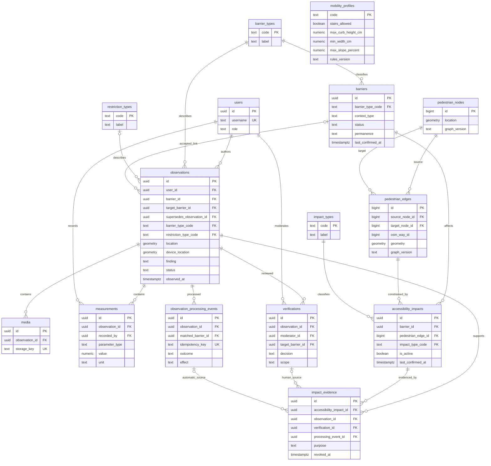
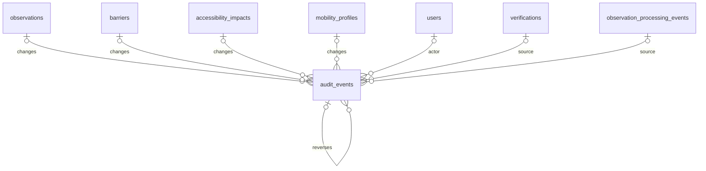

# ERD — UrbanAccess

Версия: 14 сентября 2026. Логическая реляционная схема для PostgreSQL/PostGIS. Основание: [Requirements](03-requirements.md), [Domain Model](05-domain-model.md), [политика повторной проверки](adr/ADR-001-freshness.md).

Это проект таблиц и ограничений, не выполненная миграция. Формулы весов, числовые допуски сопоставления и интервалы повторной проверки требуют калибровки; неизвестное правило не даёт права автоматически менять граф.

## 1. Обозначения и решения

- PK — первичный ключ; FK — внешний ключ; UK — уникальность; NN — NOT NULL; `?` — nullable. Если `?` отсутствует, поле обязательно.
- Идентификаторы объектов — UUID; технических узлов и рёбер — bigint, импортируемые локальные ID. Время — timestamptz, обмен и отображение исходных данных в UTC с локализацией в клиенте.
- Единственный термин — **Accessibility Impact**; класс `AccessibilityImpact`, таблица `accessibility_impacts`.
- Observation имеет Point, Pedestrian Edge — LineString. Barrier не требует собственной физической геометрии. GPS сохранён отдельной nullable-точкой Observation.
- Один фиксированный снимок пешеходного графа для пилота. `graph_version` хранит идентификатор импорта. Смена графа требует контролируемого повторного сопоставления; произвольное перезаписывание ID запрещено.
- Таблицы Route и Accessibility Assessment не нужны: это вычисляемые результаты. Справочники профилей и параметров правил не представляют пользователей.
- Типы препятствий, ограничения и влияния — отдельные таблицы. Остальные небольшие закрытые множества — CHECK или enum. Конфигурация алгоритмов хранится в версионируемом файле; события сохраняют версию и snapshot применённых настроек.

## 2. Основная диаграмма

Диаграмма показывает ключи и основные связи; полный перечень столбцов, дополнительных FK и ограничений — ниже.

Обе связи Evidence с источниками nullable по отдельности, но **ровно одна обязательна** (XOR). Это ограничение выражено ниже; две линии диаграммы не означают, что допустима запись без источника.

## 3. Пользователи и справочники

### users

| Поле | Тип | Ограничение |
|---|---|---|
| id | uuid | PK |
| username | text | UK, непустой |
| role | text | FIELD_USER / MODERATOR / ADMIN |
| created_at | timestamptz | NN, серверное время |

Для MVP роль одна; MODERATOR и ADMIN могут выполнять полевые операции, ADMIN — операции модератора. Пользователь маршрута — функция, а не дополнительная обязательная роль. Пользовательские связи не удаляются каскадно.

### barrier_types

| Поле | Тип | Ограничение |
|---|---|---|
| code | text | PK |
| label | text | NN |
| default_permanence | text | PERMANENT / TEMPORARY / UNKNOWN |
| is_enabled | boolean | NN |

Начальные code: CURB, STAIRS, FENCE, GATE, NARROW_SIDEWALK, BLOCKED_SIDEWALK, ROUGH_SURFACE, OTHER. Значение по умолчанию для FENCE — UNKNOWN до уточнения. Срок проверки задаётся конфигурацией и фиксируется в Barrier, не выводится из одного лишь названия типа.

### restriction_types и impact_types

Каждая таблица: `code text PK`, `label text NN`, `is_enabled boolean NN`.

restriction_types: BLOCKED / DIFFICULT / RESTRICTED.

impact_types: BLOCKS / NARROWS / PENALIZES / STAIRS / SURFACE_DEGRADATION.

Отключённые справочные значения сохраняются для истории. Для новой записи выбираются только включённые значения. Restriction Type не копируется в Impact Type без профильного правила.

### mobility_profiles

| Поле | Тип | Ограничение |
|---|---|---|
| code | text | PK; STANDARD_PEDESTRIAN / WHEELCHAIR / STROLLER |
| name | text | NN |
| stairs_allowed | boolean | NN |
| max_curb_height_cm | numeric | >= 0 |
| min_width_cm | numeric | > 0 |
| max_slope_percent | numeric | >= 0 |
| surface_rules | jsonb | Валидируемый объект правил покрытия |
| unknown_data_rules | jsonb | Валидируемый объект поведения при неизвестных данных |
| rules_version | text | NN |
| updated_at | timestamptz | NN |

Значения профилей не объявляются нормативами. Если критичный параметр неизвестен, применяется явно настроенное unknown_data_rules; неизвестное не приравнивается к нулю или свободному проходу. До определения такого правила автоматическое создание соответствующего влияния запрещено. Изменения профиля записываются в версионируемую конфигурацию и аудит; правила сохраняются независимо для каждого профиля.

## 4. Наблюдения и доказательства

### observations

| Поле | Тип | Ограничение |
|---|---|---|
| id | uuid | PK |
| user_id | uuid | FK users.id |
| barrier_id | uuid? | FK barriers.id; принятая связь |
| target_barrier_id | uuid? | FK barriers.id; выбранная пользователем цель, ещё не подтверждённая |
| supersedes_observation_id | uuid? | FK observations.id; CHECK не равно id |
| location | geometry(Point,4326) | Валидная непустая 2D-точка |
| position_source | text | GPS / MANUAL |
| device_location | geometry(Point,4326)? | Исходная позиция устройства |
| device_accuracy_m | numeric? | >= 0, только при device_location |
| device_captured_at | timestamptz? | Только при device_location |
| barrier_type_code | text | FK barrier_types.code |
| finding | text | PRESENT / ABSENT |
| restriction_type_code | text? | FK restriction_types.code; NN при PRESENT, NULL при ABSENT |
| context_type | text | Перечень контекстов в §9 |
| place_name | text? | Название станции/места |
| level_ref | text? | Читаемое обозначение уровня; отсутствие не равно ground |
| location_description | text? | Вход, направление, ориентир |
| comment | text? | Пользовательское пояснение |
| status | text | NEW / PENDING_MODERATION / APPROVED / REJECTED / NEEDS_CLARIFICATION / LINKED |
| moderation_required | boolean | NN, отдельно от установленной связи |
| observed_at | timestamptz | Фактическое время наблюдения |
| created_at | timestamptz | Время создания сервером |

CHECK: APPROVED/LINKED требуют barrier_id. Другие статусы могут сохранить прежнюю связь при повторном разборе — связь не равна действующему свидетельству. Для GPS требуется device_location и совпадение итоговой точки с принятой GPS-точкой; для MANUAL допускается отсутствие GPS.

Если одновременно заданы `barrier_id` и `target_barrier_id`, после принятия решения они должны указывать на один Barrier; до решения `target_barrier_id` не считается принятой связью. При переназначении сохраняется прежняя цель в событиях и аудите, затем поля приводятся к согласованному состоянию одной транзакцией.

Фото, время, координаты и исходные утверждения фиксируются при отправке. Поправка этих фактов создаёт новое Observation, исходное остаётся доступно. Статус и связь обновляются только с аудитом. Цикл supersedes запрещается сервисом; наличие новой версии не отзывает старое влияние до проверки.

### media

| Поле | Тип | Ограничение |
|---|---|---|
| id | uuid | PK |
| observation_id | uuid | FK observations.id |
| storage_key | text | UK; служебный ключ хранилища, не произвольная внешняя ссылка |
| mime_type | text | Допустимый MIME из конфигурации |
| file_size | bigint | > 0, предел из конфигурации |
| upload_status | text | PENDING / READY / FAILED |
| created_at | timestamptz | NN |

Между Observation и Media физически 1:0..N, поскольку загрузка может состоять из нескольких запросов. Перед обработкой/подтверждением требуется минимум одно READY фото. Техническая проверка файла не является проверкой его содержания.

### measurements

| Поле | Тип | Ограничение |
|---|---|---|
| id | uuid | PK |
| observation_id | uuid | FK observations.id |
| recorded_by | uuid | FK users.id |
| parameter_type | text | HEIGHT / WIDTH / SLOPE |
| value | numeric | >= 0 |
| unit | text | cm для HEIGHT/WIDTH; percent для SLOPE |
| source | text | VISUAL_ESTIMATE / MANUAL_MEASUREMENT / MODERATOR_MEASUREMENT |
| confidence | text | LOW / MEDIUM / HIGH |
| created_at | timestamptz | NN |

CHECK согласует parameter_type и unit. Физическое измерение не хранится в impact_value без единиц. Возможны несколько измерений одного параметра; правило выбора значения обязано учитывать их источник и уверенность. Дополнительный замер модератора добавляется отдельной строкой, исходный не перезаписывается.

## 5. Barrier и процессы проверки

### barriers

| Поле | Тип | Ограничение |
|---|---|---|
| id | uuid | PK |
| barrier_type_code | text | FK barrier_types.code |
| context_type | text | Тот же контекст, что у принятых Observation |
| permanence | text | PERMANENT / TEMPORARY / UNKNOWN |
| recheck_interval_days | integer | > 0; явная конфигурация, предложенные 180/7/30 не являются SQL-default |
| status | text | VERIFIED / RECHECK_REQUIRED / RESOLVED / ARCHIVED |
| recheck_reasons | text[] | AGE / ABSENT_REPORT / CONFLICT / INVALID_EVIDENCE / MANUAL; пустой массив допустим |
| first_observed_at | timestamptz | Минимальное время известных связанных наблюдений |
| last_observed_at | timestamptz | Максимальное время известных связанных наблюдений |
| last_confirmed_at | timestamptz? | Сводное время эффективных принятых PRESENT; NULL после отзыва всех оснований |
| last_verified_at | timestamptz? | Последнее решение человека, не автоматическая обработка |
| state_observed_at | timestamptz? | Время наблюдения, на котором основано последнее принятое изменение состояния |
| created_at, updated_at | timestamptz | NN |

Barrier создаётся вместе с первым одобренным PRESENT и Verification в одной транзакции. CHECK first_observed_at <= last_observed_at. Связанные ABSENT могут менять last_observed_at, но не last_confirmed_at.

При RECHECK_REQUIRED активные влияния сохраняются. RESOLVED/ARCHIVED запрещают активные влияния (транзакционный сервисный инвариант). Возврат в VERIFIED после давности требует свежести всех активных локальных влияний и отсутствия открытых вопросов. Barrier без привязки к графу допустим; при этом его давность оценивается по собственной дате.

### verifications

| Поле | Тип | Ограничение |
|---|---|---|
| id | uuid | PK |
| observation_id | uuid | FK observations.id |
| moderator_id | uuid | FK users.id; роль MODERATOR/ADMIN проверяет сервис |
| target_barrier_id | uuid? | FK barriers.id; обязателен для действий над Barrier |
| decision | text | APPROVE_NEW_BARRIER / LINK_TO_EXISTING_BARRIER / CONFIRM_ABSENCE / REACTIVATE_BARRIER / REJECT / NEEDS_CLARIFICATION |
| scope | text? | LOCAL / WHOLE_BARRIER; обязателен для CONFIRM_ABSENCE |
| confirms_presence | boolean | NN; только при принятом PRESENT и явном подтверждении |
| comment | text | Непустая причина решения |
| created_at | timestamptz | Серверное время |

Решения append-only. Новая проверка не перезаписывает старую. Для CONFIRM_ABSENCE наблюдение должно иметь finding=ABSENT и confirms_presence=false; LOCAL требует выбранных влияний через Evidence. WHOLE_BARRIER охватывает все активные влияния, либо явно неприкреплённый Barrier без них. Модератор обязан проверить, что более новые сведения не противоречат старому ABSENT.

REACTIVATE_BARRIER подтверждает новое PRESENT и включает только явно выбранные локальные влияния. Ручное снятие ошибочной привязки может использовать LINK_TO_EXISTING_BARRIER с confirms_presence=false и аудитом деактивации INVALID_EVIDENCE; физическое отсутствие при этом не утверждается.

### observation_processing_events

| Поле | Тип | Ограничение |
|---|---|---|
| id | uuid | PK |
| observation_id | uuid | FK observations.id |
| matched_barrier_id | uuid? | FK barriers.id |
| idempotency_key | text | UK |
| outcome | text | AUTO_MATCH / MODERATION |
| effect | text | NONE / LINK_ONLY / CONFIRM / CONFIRM_AND_EXTEND |
| rule_version | text | NN |
| rule_snapshot | jsonb | Применённые пороги и параметры, без секретов |
| reasons | jsonb | Структурированные причины принятого результата |
| created_at | timestamptz | NN |

CHECK: AUTO_MATCH требует matched_barrier_id и effect != NONE; MODERATION имеет NONE. LINK_ONLY может поставить moderation_required, сохранив установленную связь. События append-only. Повторная доставка с тем же ключом возвращает уже записанный результат. Новая версия правил — новое событие, но не право повторно активировать снятое влияние.

## 6. Пешеходная сеть

### pedestrian_nodes

`id bigint PK`, `location geometry(Point,4326) NN`, `graph_version text NN`. Сочетание `(id, graph_version)` имеет UK для проверки согласованности рёбер.

### pedestrian_edges

| Поле | Тип | Ограничение |
|---|---|---|
| id | bigint | PK локального сегмента |
| source_node_id | bigint | FK pedestrian_nodes.id |
| target_node_id | bigint | FK pedestrian_nodes.id |
| osm_way_id | bigint? | Внешний идентификатор, не PK и не UK |
| graph_version | text | NN |
| geometry | geometry(LineString,4326) | Валидная непустая линия |
| length_m | numeric | > 0 |
| forward_allowed, reverse_allowed | boolean | NN |
| context_type | text | Контекст сегмента |
| level_ref | text? | Уровень, если известен |
| routing_attributes | jsonb | Валидируемые базовые параметры сети |

Дополнительные составные FK `(source_node_id, graph_version)` и `(target_node_id, graph_version)` ссылаются на nodes `(id, graph_version)` и предотвращают смешивание импортов. Один OSM way может быть разделён на несколько сегментов.

Сегмент хранится один раз; допустимые направления задаются двумя флагами. Accessibility Impact в MVP относится к прохождению сегмента в обоих направлениях. Направленные ограничения, сложные повороты и перемещение внутри станции не моделируются.

Сеть должна быть достаточно сегментирована для локального ограничения. Если длинное ребро объединяет разные проходы или уровни, ближайшая точка не доказывает блокировку всего ребра: автоматическое влияние запрещено до ручного исправления/сопоставления сети.

## 7. Accessibility Impact и его основания

### accessibility_impacts

| Поле | Тип | Ограничение |
|---|---|---|
| id | uuid | PK |
| barrier_id | uuid | FK barriers.id |
| pedestrian_edge_id | bigint | FK pedestrian_edges.id |
| impact_type_code | text | FK impact_types.code |
| height_cm | numeric? | >= 0 |
| available_width_cm | numeric? | >= 0; доступная ширина, а не уменьшение относительно неизвестной ширины |
| slope_percent | numeric? | >= 0 |
| surface_condition | text? | Валидируемая категория покрытия |
| penalty_factor | numeric? | >= 1; при PENALIZES > 1 |
| is_active | boolean | NN |
| last_confirmed_at | timestamptz? | Максимальное observed_at эффективных PRESENT Evidence |
| last_verified_at | timestamptz? | Последняя ручная проверка этого влияния |
| state_observed_at | timestamptz? | Время наблюдения, обосновавшего последнее изменение параметров/активности |
| recheck_required | boolean | NN; кэш результата проверки давности/открытых вопросов |
| recheck_reasons | text[] | AGE / ABSENT_REPORT / CONFLICT / INVALID_EVIDENCE / MANUAL |
| created_at, updated_at | timestamptz | NN |

**UK `(barrier_id, pedestrian_edge_id)`**: одна текущая запись на пару, включая неактивное состояние. История изменений — в audit_events. Один доминирующий impact_type плюс независимые параметры позволяют описать сочетание ограничений; другой независимый Barrier даёт другую запись.

Для NARROWS требуется available_width_cm либо ручное определение другого поддерживаемого вида влияния; отсутствие числа не заменяется нулём. Для PENALIZES требуется penalty_factor > 1. Конкретная формула и условия выбора типа задаются правилами профиля; до настройки правила нельзя создавать произвольный штраф автоматически.

Создание/подтверждение требует основания Evidence. AUTO_MATCH не меняет параметры существующего влияния; оно лишь подтверждает совместимость. Ручное редактирование фиксирует выбранные исходные измерения и before/after в аудите.

### impact_evidence

| Поле | Тип | Ограничение |
|---|---|---|
| id | uuid | PK |
| accessibility_impact_id | uuid | FK accessibility_impacts.id |
| observation_id | uuid | FK observations.id |
| verification_id | uuid? | FK verifications.id |
| processing_event_id | uuid? | FK observation_processing_events.id |
| purpose | text | PRESENT_CONFIRMATION / ABSENCE_CONFIRMATION |
| created_at | timestamptz | NN |
| revoked_at | timestamptz? | Отзыв основания без удаления истории |
| revoked_by | uuid? | FK users.id; NN при revoked_at |
| revoke_reason | text? | Непустая причина при revoked_at |

CHECK XOR: ровно один из verification_id/processing_event_id заполнен. Частичные UK: `(accessibility_impact_id, verification_id, purpose)` WHERE verification_id IS NOT NULL; аналогично processing_event_id. Они запрещают повторное применение одного решения к тому же влиянию.

Сервис проверяет совпадение observation_id с источником решения и Barrier влияния с целевым Barrier решения. PRESENT_CONFIRMATION требует finding=PRESENT и подтверждающего последствия; ABSENCE_CONFIRMATION требует finding=ABSENT и ручного CONFIRM_ABSENCE. LINK_ONLY/NONE не создают Evidence.

Evidence сохраняет факт решения. Старая PRESENT-запись остаётся в истории после подтверждённого ABSENT, но не включает is_active обратно. Повторное включение — только новое ручное решение. Отзыв устанавливает revoked_at/by/reason и добавляет Audit Event; исходный источник остаётся неизменным.

## 8. История изменений

### audit_events

| Поле | Тип | Ограничение |
|---|---|---|
| id | uuid | PK |
| observation_id | uuid? | FK observations.id |
| barrier_id | uuid? | FK barriers.id |
| accessibility_impact_id | uuid? | FK accessibility_impacts.id |
| mobility_profile_code | text? | FK mobility_profiles.code |
| actor_user_id | uuid? | FK users.id; NULL только у системного события |
| actor_type | text | USER / SYSTEM |
| verification_id | uuid? | FK verifications.id |
| processing_event_id | uuid? | FK observation_processing_events.id |
| reverses_event_id | uuid? | FK audit_events.id; не равно id |
| action | text | Вид события, например STATE_CHANGED / PARAMETERS_CHANGED / EVIDENCE_REVOKED |
| reason | text | Непустая причина |
| before_state, after_state | jsonb | Предыдущее/новое состояние либо пустой объект при создании |
| created_at | timestamptz | Серверное время |

Минимум одна ссылка на объект обязательна; несколько допустимы для связанного события. USER требует actor_user_id, SYSTEM — NULL. Источник verification/processing взаимоисключающий, но оба могут быть NULL для системной проверки давности или административного события с причиной. Audit append-only; история не используется вместо FK текущих данных.

Открытый вопрос хранится в moderation_required и recheck_reasons с причиной/источником в аудите. AGE может закрыться автоматически по свежим данным. CONFLICT, ABSENT_REPORT, INVALID_EVIDENCE и MANUAL закрывает модератор; свежая дата не закрывает их сама.

## 9. Условия целостности и поведение

### Контексты

STREET / TRANSIT_STOP / RAILWAY_STATION / METRO_STATION / PLATFORM / UNDERGROUND_PASSAGE.

Автоматическое влияние — только STREET на STREET с совместимым известным уровнем и однозначным ребром. NULL уровня не подтверждает совпадение; неоднозначность требует модератора. TRANSIT_STOP и отдельный UNDERGROUND_PASSAGE допускают ручную привязку к реально представленному пути. Внутренние METRO_STATION, RAILWAY_STATION и PLATFORM не получают уличного влияния. Геометрическое совпадение над станцией не является маршрутом внутри неё.

### Даты и агрегаты

1. Глобальная принятая связь Observation не равна подтверждению. Barrier.last_confirmed_at рассчитывается из эффективных ручных подтверждений PRESENT (confirms_presence=true) и автоматических CONFIRM/CONFIRM_AND_EXTEND; LINK_ONLY исключается. Последующее отклонение/отзыв исключает соответствующий источник с записью аудита.
2. Локальный last_confirmed_at — максимум observed_at неотозванных PRESENT Evidence, основанных на эффективных подтверждающих решениях. Последующие ABSENT и решения об активности имеют приоритет; исторический максимум не включает влияние обратно.
3. Старые сведения, предшествующие принятому изменению состояния/параметров или выходящие за интервал проверки, не дают автоматического подтверждения. Для повторного включения неактивного влияния нужен человек независимо от возраста PRESENT.
4. Новое подтверждение обновляет только локальные Evidence. Barrier.last_confirmed_at может стать свежим, но это не снимает RECHECK_REQUIRED с остальных старых влияний.
5. При отзыве даты пересчитываются и могут уменьшиться или стать NULL. Источник с revoked Evidence не подтверждает соответствующее место. Недостоверное единственное основание — RECHECK_REQUIRED/INVALID_EVIDENCE.

### Транзакции и конкуренция

Требуют сервисной транзакции с блокировкой соответствующего Barrier/влияния либо эквивалентной проверкой версии:

- создание нового Barrier + связь Observation + Verification + аудит;
- CONFIRM_AND_EXTEND: событие + связь + одно влияние + Evidence + даты + аудит;
- LOCAL ABSENT: решение + Evidence + деактивация выбранных влияний + пересчёт + аудит;
- WHOLE_BARRIER ABSENT: то же для всех активных влияний + статус RESOLVED;
- отзыв ошибочного события: Evidence + пересчёт всех затронутых данных + аудит;
- смена связи Observation: отзыв старых последствий и применение нового решения без промежуточного несогласованного состояния.

UNIQUE предотвращает дубли при параллельных событиях; возникший конфликт обрабатывается повторным чтением текущего состояния. Порядок по observed_at важнее времени доставки: запоздавший PRESENT не должен отменить более позднее подтверждённое отсутствие.

Декларативные FK/CHECK/UK не доказывают наличие фото, роль модератора, совпадение контекстов между таблицами или корректность переходов. Эти межтабличные инварианты проверяет транзакционный сервис; они должны попасть в тесты реализации. Миграции не могут ограничиться одной диаграммой.

### Удаление

Для перечисленных FK — ON DELETE RESTRICT/NO ACTION. Наблюдения, решения и историю не удаляют при объединении. Влияния деактивируют, Evidence отзывают. Ручное переназначение сохраняет прежние цели в событиях. Удаление файлов и политика хранения персональных данных проектируются отдельно; автоматическое удаление пользовательских доказательств в этом MVP не вводится.

## 10. Индексы и пространственные операции

- GiST по observations.location и pedestrian_edges.geometry; индекс GPS не нужен для основного поиска.
- B-tree по observations `(barrier_id, observed_at DESC)`, `(status, created_at)`, `(moderation_required, created_at)` и `(barrier_type_code, context_type)`.
- B-tree по barriers `(status, permanence)` и accessibility_impacts `(barrier_id, is_active)`; UK пары Barrier/Edge.
- B-tree по Evidence `(accessibility_impact_id, revoked_at)`, observation_id и обоим источникам; по событиям `(observation_id, created_at)`.
- Для FK поддерживаются индексы на дочерних ссылках, если их не покрывает перечисленный составной индекс.
- Радиусы в метрах вычисляются через geography или подходящую метрическую проекцию. Нельзя интерпретировать расстояние geometry SRID 4326 в градусах как метры. Для geography-поиска можно добавить соответствующий GiST expression-index при реализации; выбор проверяется планом запроса.
- Ближайшее ребро — кандидат. Проверяются радиус, тип пути, уровень, сторона/контекст, пригодность сегмента. Поиск в 5 м не является доказательством тождества объектов.

## 11. Трассировка ERD к требованиям

| Требования | Таблицы/механизм |
|---|---|
| FR-001–FR-007, FR-010–FR-017, FR-084 | observations, media, measurements, справочники |
| FR-020–FR-024, FR-077 | observations, observation_processing_events, принятое положение кандидатов |
| FR-008, FR-025–FR-027, FR-034–FR-036 | verifications; содержание фото оценивает человек |
| FR-030–FR-031, FR-043–FR-050, FR-079 | accessibility_impacts, impact_evidence, pedestrian_edges |
| FR-038–FR-040, FR-078, FR-083 | barriers, локальные даты влияний, verifications, audit_events |
| FR-051–FR-060 | mobility_profiles, pedestrian_nodes/edges, активные влияния |
| FR-071–FR-072, FR-080–FR-081 | observation_processing_events, verifications, audit_events, отзыв Evidence |
| FR-082 | context_type, place_name, level_ref, ограничения уличной привязки |

## 12. Готовность к реализации

Схема готова как основание миграций: определены таблицы, PK/FK, optional-связи, текущая запись влияния, происхождение подтверждений и аудит. Следующий технический этап — миграции и первый сценарий Observation → ручная проверка → Barrier → Accessibility Impact с тестами транзакционных инвариантов. Политика сроков остаётся рабочим предложением, подробно отмеченным в ADR-001.
